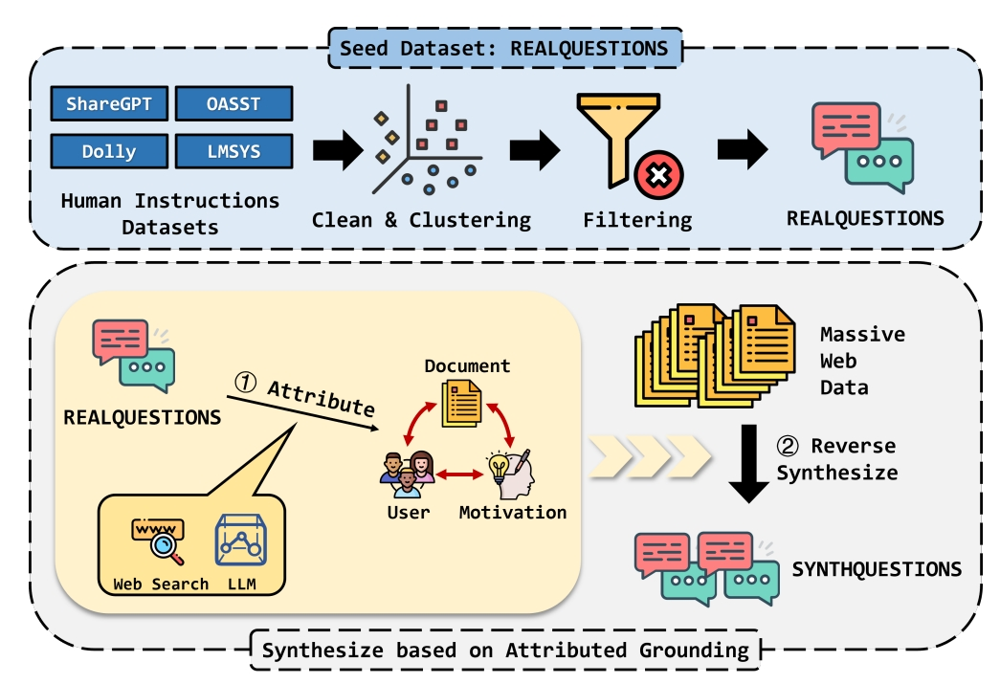

<h1 align="center">SynthQuestions</h1>

This is the code repo for the paper **From Real to Synthetic: Synthesizing Millions of Diversified and Complicated User Instructions with Attributed Grounding**. 

<p align="center">

</p>

In this paper, we attribute an instruction to three main components: **Document, User** and **Motivation**. 

Starting with a high-quality seed dataset, we synthesize **Complicated**, **Diverse** and **Grounded** instructions with the following steps:

- Search the web documents for each instruction and ground the instruction to the documents by reconstruction a lifelike scene with a user and a motivation. The grounded dataset will be used as **demonstrations** later.
- Using the above grounded instructions as demonstrations, generate lifelike scenes and queries from existing web corpora like 🤗 [FineWeb](https://huggingface.co/datasets/HuggingFaceFW/fineweb).


## Data and Models

You can find all the data and checkpoints in the Huggingface Hub Collection  [SynthQuestions](https://huggingface.co/collections/IgnoraZ/synthquestions-6848f8f22e063cff5e55266e), which contains the following components:

- 29K human instructions collected from several open-source datasets.
- 1M instructions synthesized with our pipelines.
- 100K preference data annotated with 🤗 [RLHFlow/ArmoRM-Llama3-8B-v0.1](https://huggingface.co/RLHFlow/ArmoRM-Llama3-8B-v0.1).
- The models trained with the above data.


## Synthesize Your Own Data

In the following code we leave the model, the search API and the token counter blank, which you should implement on your own in `utils.py`.

### 1 Prepare Seed Data

Prepare your own seed data. In the following steps, we assume that the seed data is in a JSONL file, where each line shows a dictionary like this:

```json
{
    "id": "xxx",
    "prompt": "xxx"
}
```

### 2 Extract Keywords & Search Documents

Run `extract_keywords.py` to extract keywords from the seed datasets.

```shell
python src/extract_keywords.py \
	--input_file /path/to/input \
	--output_path /directory/to/save/the/output/files \
	--n_total_process /process/num
```

The extracted keywords will be saved with a key `keywords`.

Then you can utilize the keywords as queries for search engine and keep the 1st ranked documents in the search results. In the next step, we assume they are stored with the key `document` . 

### 3 Attributed Grounding

Then run `grounding.py` to reconstruct the scene which links the document and the query.

```shell
python src/grounding.py \
	--input_file /path/to/input \
	--output_path /directory/to/save/the/output/files \
	--n_total_process /process/num
```

### 4 Query Generation

Then run `query_generate.py` to synthesize new instructions based on existing web corpora and demonstrations drawn from the attributed datasets above. We assume that the corpora are stored with JSONL files and there is `document` key in the dictionaries. 

```shell
python src/query_generate.py \
    --input_path /path/to/input/web/corpora \
    --demonstration_path /path/to/files/generated/in/step/3 \
    --output_path /directory/to/save/the/output/files \
    --document_length_limit /max/token/length/of/document \
    --n_total_process /process/num
```

### 5 Scoring

Finally, you can run `score.py` to assess the quality of generated queries.

```shell
python src/score.py \
	--input_file /path/to/input \
	--output_path /directory/to/save/the/output/files \
	--n_total_process /process/num
```

### [Optional] Diversity-based Filtering and Moderation

There are two optional operations that can be conducted. As we utilize off-the-shelf tools in these operations, we do not include the extra codes here.

- We utilize [BERTopic](https://maartengr.github.io/BERTopic/index.html) to model the topic of instructions, and select instructions with the highest scores in each topic, maximizing the diversity of the dataset.

- We utilize 🤗 [LLaMA-Guard-3-8B](https://huggingface.co/meta-llama/Llama-Guard-3-8B) to moderate the instructions and find the potential risks.

## Citation

```latex
@misc{zhu2025realsyntheticsynthesizingmillions,
      title={From Real to Synthetic: Synthesizing Millions of Diversified and Complicated User Instructions with Attributed Grounding}, 
      author={Chiwei Zhu and Benfeng Xu and Xiaorui Wang and Zhendong Mao},
      year={2025},
      eprint={2506.03968},
      archivePrefix={arXiv},
      primaryClass={cs.CL},
      url={https://arxiv.org/abs/2506.03968}, 
}
```


